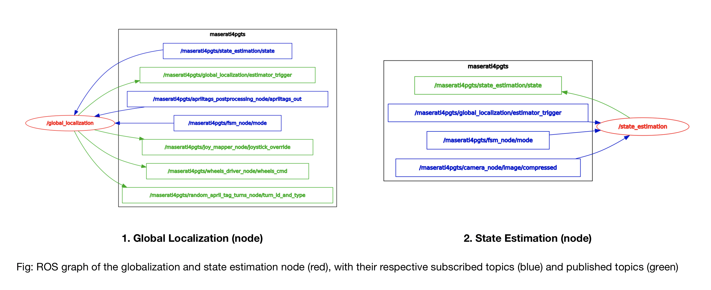

     

# General info
<!--{#goto_1_info}-->
Author: [J. Boghaert](https://github.com/Jboghaert)

Tutors: [M. Hosner](https://github.com/hosnerm), [G. Zardini](https://github.com/gzardini)

More information on the Global Localization problem can be found either in the [GOTO1.md file](https://github.com/duckietown-ethz/proj-goto-1/blob/master/GOTO1.md) with a brief explanation on the pipeline and code packages in this repository or more extensively in the [final report](https://drive.google.com/file/d/16wffD6FrJ81WGrtCKoku1a_nmQv3DsbB/view) of this Duckietown project, given in the Autonomous Mobility on Demand class at ETH Zürich, 2019.

# Teaser
<!--{#goto_1_teaser}-->
A successful run of the GOTO-1 demo version can be found [here](https://drive.google.com/file/d/1ceo435i2H9kbQmCQbiqCNoKmAQx5jAJe/view) for localization, path planning and navigation of the Duckiebot, and [here](https://drive.google.com/file/d/1__jHM4iRiDjxXo_UnNaNH6fftmc-62mf/view) for navigation, state estimation and shutdown procedure of the GOTO-1 project.

# Duckietown set-up notes
<!--{#goto_1_set_up_notes}-->
For the GOTO-1 project, any Duckietown configuration can be used that adheres to the [specifications](https://docs.duckietown.org/daffy/opmanual_duckietown/out/dt_ops_appearance_specifications.html). However, certain additional limitations were made in order for the localization, planning and execution of the *global localization* solution to make sense. These can be found under [Prerequisites and assumptions](#goto_1_implementation).

<!-- GOTO-1 restrictions/limitations
- the AT density within Duckietown should stay within reasonable limits and should ideally not exceed the already implemented AT's (s.a. stop signs, intersection signs, streetnames, ...)
- no visual marks - other than the ones outlined in the [appearance specifications](https://docs.duckietown.org/daffy/opmanual_duckietown/out/dt_ops_appearance_specifications.html) - can be used for initial localization, navigation and stopping of the Duckiebot
- no U-turns are allowed within Duckietown - basic traffic rules should be taken into account
- the Duckiebot should stay within the lanes, and should have the correct orientation (right lane driving direction)
-->

# Demo pre-flight checklist
<!--{#goto_1_checklist}-->
A quick pre-flight checklist for running the GOTO-1 demo is provided below:
- Make sure all assumptions and restrictions for GOTO-1 as explained in [Prerequisites and assumptions](#goto_1_implementation) are met.
    * Set up the Duckiebot as explained in section [Prerequisites and assumptions](#goto_1_implementation).
    * Set up a correctly configured Duckietown as explained in section [Prerequisites and assumptions](#goto_1_implementation), and make sure the DT map is configured as in `path_planning_class` (more info can be found in the [final report](https://drive.google.com/file/d/16wffD6FrJ81WGrtCKoku1a_nmQv3DsbB/view)). The current default, hardcoded Duckietown [configuration](https://github.com/duckietown-ethz/proj-goto-1/blob/master/media/lab_dt_map.png) is the one used for the final demo presentation of AMoD 2019 in room ML K31.
    * Additionaly, make sure your Duckiebot has a full battery before connecting or building anything.
- Set up the altered framework of the `indefinite_navigation` demo on which GOTO-1 will be built, as further explained in section [Setting up the framework](#goto_1_implementation).
- Check if the activated Docker containers are visible in Portainer, accessed via *DUCKIEBOT_NAME.local:9000* (repeat this check after every newly run Docker container). Check if the containers are up and running by checking their log.
- Implement the GOTO-1 functionality on top of `indefinite_navigation` as further explained in section [Implementing GOTO-1](#goto_1_implementation).
    * Make sure to define the input parameters correctly. I.e. `goal_input` as the AT defining the lane (the AT itself will not be read by the Duckiebot in normal circumstances) and `goal_distance` as distance between final intersection and arrival point in cm.
    * Check whether the ROS graph of the entire GOTO-1 module is correct using `rqt_graph` and use `rqt_image_view` to check whether the camera functions properly (further explained in section [Additional functionalities](#goto_1_implementation)).
- Run the demo using the joystick controller, as explained in section [Implementing GOTO-1](#goto_1_implementation).

# Demo instructions
<!--{#goto_1_implementation}-->
The scripts within the GOTO-1 project are written for the 2019 Duckietown (AMOD) class at ETH Zürich. The entire project is based on a ROS-template providing a boilerplate repository for developing ROS-based software in Duckietown, to be found [here](https://github.com/duckietown/template-ros). Throughout this document `$ some_command` refers to a command from the terminal within the project directory, and `# some_command` refers to a command within the root of a Docker container (accessed using `/bin/bash`). Also, make sure to replace `DUCKIEBOT_NAME` in every command with the name of your Duckiebot.

Running the project should be implemented in the existing framework of `indefinite_navigation`, more info to be found [here](https://docs.duckietown.org/daffy/opmanual_duckiebot/out/demo_indefinite_navigation.html) with the default rosgraph to be found [here](https://github.com/duckietown-ethz/proj-goto-1/blob/master/media/indefinite_navigation_default_rosgraph.png). This framework allows us to comply with the Duckietown traffic rules, lane following and the necessary task prioritization of incoming commands. The implementation of the GOTO-1 project requires some changes to be made within the `indefinite_navigation` framework, which are outlined in the next sections.

## 1. Prerequisites and assumptions:
The GOTO-1 package assumes the following assumptions within the Duckietown environment set-up:
- DT map as hardcoded in `path_planning_class` (the demo example can be found [here](https://github.com/duckietown-ethz/proj-goto-1/blob/master/media/lab_dt_map.png)),
- no varying lighting conditions,
- no external factors (s.a. obstacles on the roads),
- an acceptably functioning `indefinite_navigation` demo version with ROS graph as attached.

In addition, in order to function properly and start using the ([daffy](https://docs.duckietown.org/daffy/index.html)) Duckietown-environment in the first place, GOTO-1 requires the following:
- a well calibrated Duckiebot, i.e. using [wheel calibration](https://docs.duckietown.org/daffy/opmanual_duckiebot/out/wheel_calibration.html) and [camera calibration](https://docs.duckietown.org/daffy/opmanual_duckiebot/out/camera_calib.html) (more [here](https://docs.duckietown.org/daffy/opmanual_duckiebot/out/index.html)),
- a well set-up laptop (preferably Ubuntu), further explained [here](https://docs.duckietown.org/daffy/opmanual_duckiebot/out/laptop_setup.html),
- a well established connection between Duckiebot and (any) desktop, further explained [here](https://docs.duckietown.org/daffy/opmanual_duckiebot/out/setup_duckiebot.html),
- a correctly set up Duckietown configuration (more info [here](https://docs.duckietown.org/daffy/opmanual_duckietown/out/dt_ops_assembly.html)).

## 2. Setting up the framework:
Before building anything, make sure to be connected to your Duckiebot, and retrieve its IP address through:
~~~~
$ ping DUCKIEBOT_NAME.local
~~~~
Then, make sure to pull the latest docker images for `dt-core`, `dt-car-interface` and `dt-duckiebot-interface` through:
~~~~
$ docker -H DUCKIEBOT_NAME.local pull duckietown/dt-car-interface:daffy
$ docker -H DUCKIEBOT_NAME.local pull duckietown/dt-duckiebot-interface:daffy
$ docker -H DUCKIEBOT_NAME.local pull duckietown/dt-core:daffy
~~~~

Run the required demo containers (also outlined [here](https://docs.duckietown.org/daffy/opmanual_duckiebot/out/demo_indefinite_navigation.html)) and make sure no (old) `dt-core`, `dt-car-interface` or `dt-duckiebot-interface` are running. You could also manually start these demo containers from Portainer (accessed through *DUCKIEBOT_NAME.local:9000/#/containers* in a browser) if you already ran them before. Within Portainer, you will also be able to see the logging services of all containers running and inspect the DUCKIEBOT's behaviour. Now, run:
~~~~
$ dts duckiebot demo --demo_name all_drivers --duckiebot_name DUCKIEBOT_NAME --package_name duckiebot_interface --image duckietown/dt-duckiebot-interface:daffy
$ dts duckiebot demo --demo_name all --duckiebot_name DUCKIEBOT_NAME --package_name car_interface --image duckietown/dt-car-interface:daffy
~~~~

As mentioned, the demo container for `indefinite_navigation` is altered by excluding the node of `random_april_tag_turns_node`, and - in a next step - replacing it with the GOTO-1 package. The exclusion is done by altering the `indefinite_navigation.launch` file and putting the boolean value of `random_apriltag` to *"false"* as follows:

~~~~
$ docker -H DUCKIEBOT_NAME.local run -it --name dt-core-goto1 -v /data:/data --privileged --rm --net host duckietown/dt-core:daffy /bin/bash
~~~~
Then, once inside the root, navigate to the `packages/duckietown_demos/launch` directory and then install the text editor *vim* (or any other text editor) to change the boolean value within the correct file.
~~~~
# cd packages/duckietown_demos/launch
# apt-get update
# apt-get install vim
# vim indefinite_navigation.launch
~~~~
Once inside the file, press *"i"* to edit, and `esc` followed by *":wq"* to close and save the file. Then, launch the altered `indefinite_navigation`:
~~~~
# roslaunch duckietown_demos indefinite_navigation.launch veh:="DUCKIEBOT_NAME"
~~~~

**Note:** The above procedure of installing vim should be performed every time when preparing the `indefinite_navigation` framework for the GOTO-1 implementation. An alternative approach was opted in section [Future Improvements](#goto_1_improvements), but not yet implemented.

**Important:** Keep the demo containers running at all times, and allow the containers enough time (about 3 minutes) to be up and running. Use a new terminal window for the next section(s).

## 3. Implementing GOTO-1:

Once the framework is set up, build the image:
~~~~
$ dts devel watchtower stop -H DUCKIEBOT_NAME.local
$ chmod +x ./packages/my_package/src/localization_node.py
$ chmod +x ./packages/my_package/src/state_estimation.py
$ dts devel build -f --arch arm32v7 -H DUCKIEBOT_NAME.local
~~~~
Then run the GOTO-1 module, and access its root to pass the desired input commands (change the values of these parameters):
~~~~
$ docker -H DUCKIEBOT_NAME.local run -it --name proj-goto-1 --privileged -v /data:/data -e ROS_MASTER_URI=http://DUCKIEBOT_IP:11311/ --rm --net host duckietown/IMAGE_NAME:IMAGE_TAG /bin/bash
# roslaunch my_package proj_goto_1.launch goal_input:="199" goal_distance:="40"
~~~~
If you want to pass tuning values right away (these can always be changed later during runtime), use the following instead of the previous command (change the values to what suits your Duckiebot best):
~~~~
# roslaunch my_package proj_goto_1.launch goal_input:="199" goal_distance:="40" new_v_bar:="0.5" inter_nav_ff_left:="0.4" inter_nav_ff_right:="-0.6" inter_nav_time_left_turn:="3.2" inter_nav_time_right_turn:="1.5"
~~~~
Start the demo as follows, from another terminal:
~~~~
$ dts duckiebot keyboard_control DUCKIEBOT_NAME
~~~~

Once up and running, your ROS graph should display something like the [ROS graph](https://github.com/duckietown-ethz/proj-goto-1/blob/master/media/ros_nodes.png) attached.

**Note:** All values have been assigned default values as defined in the `proj_goto_1.launch` file [here](https://github.com/duckietown-ethz/proj-goto-1/blob/master/packages/my_package/launch/proj_goto_1.launch). Although these give some useful behaviour and you could leave them out from the command, you are encouraged to find the most optimal trim values for your Duckiebot yourself.

<!--

     

-->

## 4. Stopping procedure:
When stopping the GOTO-1 module, do the following:
- close all auxiliary terminals you might have used (s.a. joystick control, start_gui_tools, rviz, ...),
- stop all activated and created containers in portainer (accessed through *DUCKIEBOT_NAME.local:9000/#/containers* in a browser), wait for the processes to finish cleanly,
- ssh into your Duckiebot using the following command. Wait for 30 seconds before plugging out the battery.
`$ ssh DUCKIEBOT_NAME sudo poweroff`

## 5. Additional functionalities:
The following packages can be of further help to analyze (any) node or node-system:

In order to see the ROS graph, to see what your Duckiebot sees or to use any rqt functionalities:
~~~~
$ dts start_gui_tools DUCKIEBOT_NAME
# rostopic list
# rosparam list
# rqt
# rqt_graph
# rqt_image_view
~~~~

In order to dynamically adjust parameters (during run-time), start another container and pass parameters using /bin/bash as follows:
~~~~
$ docker run -it --rm  -e ROS_MASTER_URI="http://DUCKIEBOT_IP:11311/" duckietown/dt-ros-commons:daffy-amd64 /bin/bash
# rosparam list
# rosparam get /directory/path/file
# rosparam set /directory/path/file DESIRED_VALUE
~~~~

<!--IGNORE

# Running GOTO-1
Carefully follow the steps below to implement the proj-goto-1 solution onto your duckiebot.
- [ ] Read the README.md file
- [ ] Scan through the scripts and change the name of the DB if necessary
- [ ] Read the cmd.txt file
- [ ] Add any desired or necessary extensions to your operating system (s.a. dts shell, docker, ...)
- [ ] Execute the cmd.txt file and change all DB dependent parameters if necessary (s.a. IP address and name)

UNTIL HERE-->

# Troubleshooting
<!--{#goto_1_troubleshooting}-->
The existing framework of `indefinite_navigation` was at the time of testing not stable, and issues may arise within the development branch of Duckietown (`daffy`). Example videos of that can be found [here](https://drive.google.com/file/d/1UeRevwjQu62ARu0INYo6YaVFOHmZ3tOM/view) for AT detection where the Duckiebot is supposed to go straight but reads out an incorrectly oriented AT, [here](https://drive.google.com/file/d/1y1i8eiXv-RWP5j5Na8e2t8xoGfEP4eeL/view) for intersection navigation where the Duckiebot is supposed to take a left turn and [here](https://drive.google.com/file/d/1UkE1kg3MPbjpTgVxW5ECx_uzblhUJiCY/view) for lane following. In those cases, the following may be of help:

> **Symptom:** The Duckiebot does not navigate well at intersections (overshoot) and/or does not follow the lane smoothly:

**Resolution:** the scripts for GOTO-1 can overrule the gain and trim values with new values passed through the command terminal (or through the root of another running Docker container):
- for calibrating `intersection_nagivation` see the file [here](https://github.com/duckietown-ethz/proj-goto-1/blob/master/media/debug_intersection_navigation.pdf)
- for calibrating `lane_following` see [here](https://github.com/duckietown-ethz/proj-goto-1/blob/master/media/debug_intersection_navigation.pdf)
- **note**: the `kinematics_node/gain` parameter affects both linear and angular velocity, so preferably do not use this when you want to tune only the linear velocity

> **Symptom:** There is a persisting tendency for the Duckiebot to not read out the correctly oriented AT at an intersection:

**Resolution:** Intervene manually or simplify the Duckietown lay-out and other restrictions:
- intervene using the joystick controller
- take out non-intersection sign AT's (s.a. STOP, ROAD_NAME, ...) such that there are no other AT's present as the ones hardcoded in `path_planning_class`

> **Symptom:** State estimation does not function properly or a low accuracy of state feedback is encountered:

**Resolution:** This requires finetuning of several parameters, but should be stable once a value exhibits well-functioning behaviour:
- tune the camera frame rate in the `state_estimation` node (minimal values are given, but could be increased in order to be more precise in detecting midline stripe discontinuities)
- tune the rospy rate used by the `global_localization` node and the `state_estimation` node to obtain an optimal processing of incoming camera images and passing of state feedback
- tune the linear velocity `v_bar` of the `lane control` node (this can be passed upon starting the GOTO-1 package or dynamically via the `# rosparam set` command)
- **note**: changing the above values is likely to have an influence on `lane_following` as well, for which other values might need to be tuned as well (see the first symptom).

> **Symptom:** The set-up of the Duckiebot is incorrect (s.a. network problems, lost connection, blinking, ...) or more general problems with the `indefinite_navigation` framework:

**Resolution:** Revisit the requirements of setting up your laptop, building the Duckiebot and running `indefinite_navigation`
- issues regarding the set-up of your Duckiebot: [here](https://docs.duckietown.org/daffy/opmanual_duckiebot/out/setup_troubleshooting.html#part:setup-troubleshooting)
- issues regarding the use of the `indefinite_navigation` framework: [here](https://docs.duckietown.org/daffy/opmanual_duckiebot/out/trouble_unicorn_intersection.html)

In general, sufficient time should be spent for tuning the parameter values of the Duckiebot. Note however, that a single success for a certain set of parameter values does not necessarily mean the values have converged and are optimal for all other trials.

# GOTO-1 Improvements
<!--{#goto_1_improvements}-->
As for any project, there are certain aspects of the GOTO-1 package and the involved framework of `indefinite_navigation` that can be improved. In especially, the following submodules could benefit from the following:
- the `apriltag_detection` could make use of the AT pose in order to filter out only the correctly oriented AT's (as AT's parallel to the line of sight currently can be favoured over the ones that are perpendicular to the line of sight),
- the `state_estimation` module and its accuracy could be improved by increasing the rate of analyzed frames, and lowering the upper bound for linear velocity (note that the latter also requires to finetune the other `lane_following` parameters,
- the `intersection_navigation` parameters are currently passed as a feedforward command, and are not tailored a specific Duckiebot (developing a better feedback-based intersection navigation is currently part of another project),
- the `lane_control` parameters are currently very unstable, and are again not tailored to a specific Duckiebot (developing a better adaptive lane control module is currently part of another project as well). During the development of GOTO-1, it was opted to do the next substeps. These should then allow to build an updated version of the dt-core, with the improved modules from the adaptive lane control project and the `random_apriltag` parameter as *false*.
    - permanently fork the `dt-core` repository,
    - change the base image of the GOTO-1 Dockerfile to dt-core (you want to build upon this image in order to be able to alter it, rather than the default dt-ros-commons image)
    - attach the `lane_control` and `line_detector` packages developed in the `lane_control` [project](https://github.com/duckietown-ethz/proj-lf-adaptive) (AMOD 2019) by S. Arreghini and P. Griffa to the GOTO-1 repository,
    - attach and tailor the .launch files for dt-core by again putting the value of `random_apriltag` to *false*,
    - execute this .launch file by including it in the original proj-goto-1.launch file,
    - **note**: this alternative was in the end not implemented, as the timeframe at the remaining time of development was limited and the (stable) implementation was only proved for `lane_following` and not yet for the larger `indefinite_navigation` module.
- implementation of `duckietown-world` [repo](https://github.com/duckietown/duckietown-world) as basis for the Dijkstra graph, in order to switch more dynamically between various Duckietown configurations. For that, a mapping from the position of the AT's in the `dt-world` format to the format of the Dijkstra graph in the `path_planning_class` should be build.
