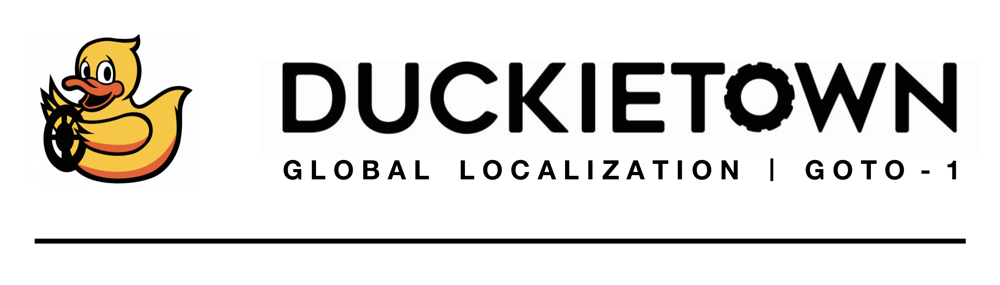
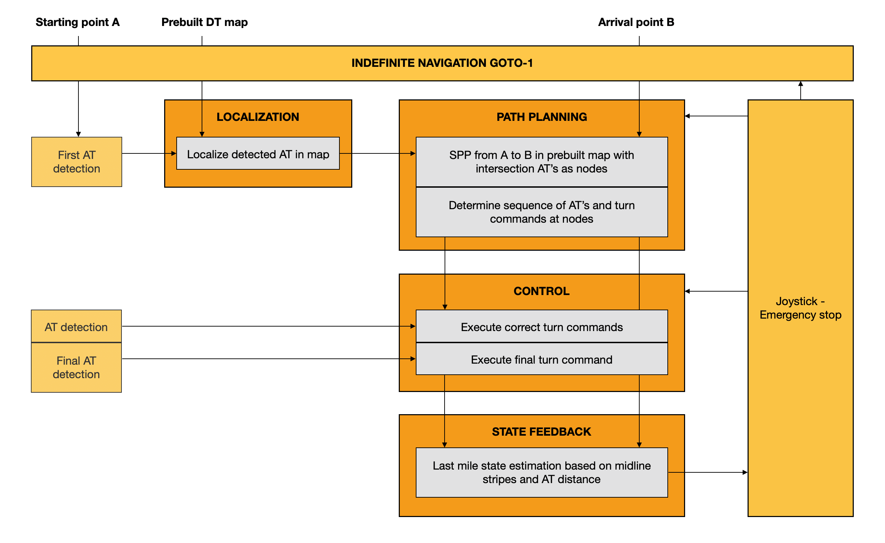

<div figure-id="fig:header">
     
</div>


# Global Localization GOTO-1
Author: J. Boghaert

Tutors: M. Hosner, G. Zardini

Add Description & objective


## Content & pipeline structure
Within the `packages/my_package/src` directory, all nodes and external classes for the GOTO-1 project can be found. The figure below shows the overall pipeline of the project. 

<div figure-id="fig:pipeline_vis">
     
</div>

**Legenda:** Unmarked inputs are given or self-determined, grey-marked blocks are running in the existing framework of `indefinite_navigation`, and grey-marked items within a blue box represent the custom blocks developed for GOTO-1.

#### 1. localization_node
This node **localizes** the duckiebot and uses an external path planning class to generate the **shortest path** to get from the localized point to a given destination point. It is the main code of GOTO-1 and generates the desired turn commands at each intersection, as well as the stop command upon arrival. The driving input of this code are the intersection AT's, serving as nodes for the `path_planning_class` outlined next.

**Note:**
The code itself explains in- and output arguments, as well as additional, more detailed information on the exact approach and reasoning behind the code.

#### 2. path_planning_class
This class is imported by `localization_node` and calculates the **shortest path** given an input and output node within the predefined DT map. The predefined DT map is hardcoded in this class.

#### 3. state_estimation_node
This node executes the **last mile** problem of proj-goto-1 by converting the input distance (from a certain AT) to passing a desired number of midline stripes and visually counting these until the desired position is reached.


## Implementation prerequisites
The scripts within the GOTO-1 project are written for the 2019 Duckietown (AMOD) class at ETH Zürich. The entire project is based on a ROS-template providing a boilerplate repository for developing ROS-based software in Duckietown, to be found [here](https://github.com/duckietown/template-ros).

Running the project should be implemented in the existing framework of `indefinite_navigation`, more info to be found [here](https://docs.duckietown.org/daffy/opmanual_duckiebot/out/demo_indefinite_navigation.html). This framework allows us to comply with the Duckietown traffic rules, lane following and the necessary task prioritization of incoming commands. The implementation of the GOTO-1 project requires some changes to be made within the indefinite navigation framework, which are outlined in the next sections.

### Setting up the framework
Include ros graph default

### Implementing GOTO-1
Include ros graph with altered structure

### Important assumptions
This code assumes the following assumptions within the Duckietown environment set-up:
- DT map as hardcoded in `path_planning_class`,
- no other AT's present as the ones hardcoded in `path_planning_class`,
- no varying lighting conditions,
- no external factors (s.a. obstacles on the roads),
- an acceptably functioning `indefinite_navigation` demo version with ROS graph as attached.


## Running GOTO-1
Carefully follow the steps below to implement the proj-goto-1 solution onto your duckiebot.
- [ ] Read the README.md file
- [ ] Scan through the scripts and change the name of the DB if necessary
- [ ] Read the cmd.txt file
- [ ] Add any desired or necessary extensions to your operating system (s.a. dts shell, docker, ...)
- [ ] Execute the cmd.txt file and change all DB dependent parameters if necessary (s.a. IP address and name)

Commands:
```
$ dts devel watchtower stop -H *DUCKIEBOT_NAME*.local
$ chmod +x ./packages/my_package/src/localization_node.py
$ chmod +x ./packages/my_package/src/state_estimation.py
$ dts devel build -f --arch arm32v7 -H *DUCKIEBOT_NAME*.local
$ docker -H *DUCKIEBOT_NAME*.local run -it --name proj-goto-1 --privileged -v /data:/data -e ROS_MASTER_URI=http://*DUCKIEBOT_IP*:*PORT*/ --rm --net host duckietown/*IMAGE_NAME:IMAGE_TAG* /bin/bash
$ roslaunch my_package proj_goto_1.launch goal_input:="199" goal_distance:="40"
```

## Troubleshooting
As the existing framework of `indefinite_navigation` is not stable, and issues may arise within the development branch of Duckietown (`daffy`), the following may be of help:
- the scripts for GOTO-1 can overrule the gain and trim values with new values passed through the command terminal,
